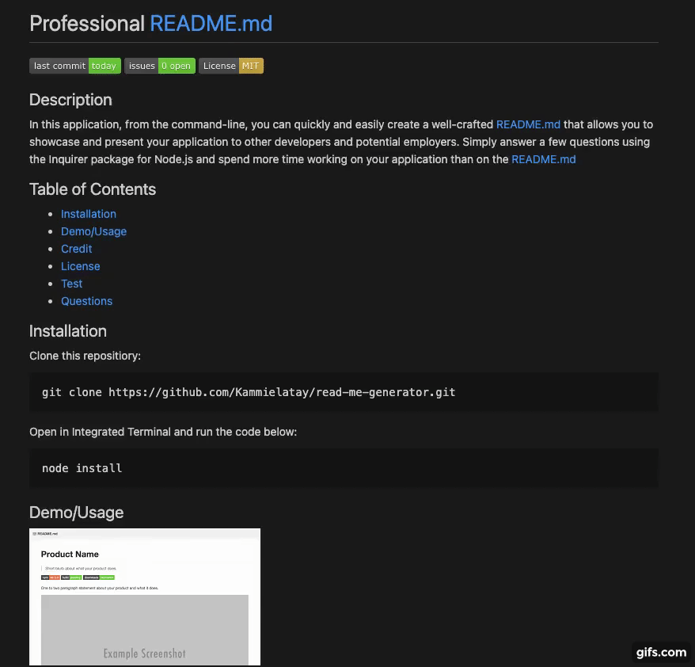

# Professional README Generator

## Description

When working on an application, developers tend to want to spend more time creating their project rather than spending time writing a README file. We all know how important it is to have a README for our projects but we don't like to do them so much. 

There is a quick solution to that problem. 

I decided to cut down my time creating a README file by asking a few questions in [Node.js](https://nodejs.org/en/) using the [Inquirer package](https://www.npmjs.com/package/inquirer) and having one generated for me. It looks professional and clean and I can get back to doing the stuff that I love in no time at all. 

Through creating this application, I learned how to download node packages to use in my program. I learned how to write files and how to generate client-side applications from within the command-line. I have a better grasps of what dependencies are and how to interconnect mulitple files to break up code and make it readable and efficient. 


[](https://opensource.org/licenses/MIT)

## Table of Contents
* [Installation](#installation)
* [Usage](#usage)
* [License](#license)
* [Tests](#test)
* [Questions](#questions)

## Installation
1) Clone this repositiory to your local computer using terminal or bash:

    ```
    git clone https://github.com/Kammielatay/read-me-generator.git
    ```

2) Open folder in your editor of choice (VSC, Sublime, etc.)

## Usage


The above demonstration shows how when ran correctly, you will be prompted with a number of questions regarding your project, such as Title, Description, Installation, Tests, and more. 

When all questions have been answered and there is no error, a message saying 'Success' will appear to let you know that you have successfully generated a sample README file. 


The above demonstration gives a preview of what your generated README file will look like once complete. 

## License
Distributed under the [](https://opensource.org/licenses/MIT) License. See [OpenSource.org](https://opensource.org/licenses) for more information.

## Tests

1) Select 'Open in Integrated Terminal' by simply right-clicking 'index.js' and run the code below:

    ```
    node install
    node index.js
    ```
2) Click on the 'sampleReadMe' file that was created to see your generated README file.

## Questions
If you have any questions, please reach out to me at Kameshialatay@gmail.com
